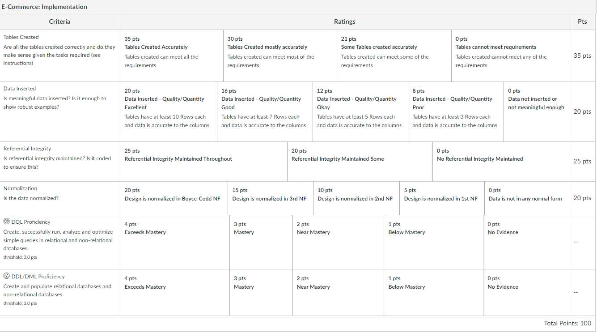

Project 2: Alternative Language Project  
Alternative Language Project

---
**Purpose**: To practice and demonstrate proficiency in using an alternative programming language of your choice.

**Skills Used**: Programming with a new language

**Knowledge Goals**: All programming concepts and structures within a new language

## **Summary**
In this assignment, you are going to be given the opportunity to explore a new programming language. You will be given a project idea. The programming languages you may complete this project in are below. Be careful and ensure you can set up the environment in order to work with the language of your choice. You may not choose Java or Python, as the point is for you to explore a new language. While I am giving the option to use the programming languages below, be aware the most in-demand languages in Seattle are: Java, Python, Javascript and C++ (can't choose the first two). Also, here is a helpful infographic to help you: Top Programming LanguagesLinks to an external site.

* C
* C++
* C#
* Rust
* PHP
* Ruby
* F#
* R
* Kotlin
* COBOL (discuss with me first you choose this)
* FORTRAN  (discuss with me first you choose this)
* Any other language of your choice, but you must get approval from the instructor first. Be aware, you will have to use OOP in this assignment, so choose wisely.

**Please note, you now have a Git usage in command line requirement with each project. Please see "Some other items of importance" below for more on this.**

For this project, you will read in a CSV file that has statistics for 1000 cell phones. You will then create a class called Cell and assign the column as class attributes. Create getter and setter methods. The objects will be stored in a data structure native to the language. You are free to pick what your data structure is but if your language has a HashMap type data structure, I strongly encourage you using it.

## Data Ingestion and Cleaning
You must perform transformations on the data as it comes in or after it is been ingested. This a process called data cleaning and these are the steps:

Remove any duplicate rows. So a duplicate row would have the same values for each column. If you pick the right data structure, this might be done for you.
Replace all missing or "-" values with null or something similar that can be ignored during calculations.
Transform data in appropriate columns according to instructions. For example in the body_weight column, a typical value is '190 g (6.70 oz)'' and needs to be converted to 190.
Convert data types in appropriate columns

Note: Be aware: a null value can look very different in different languages. Research how your language represents null values and use what makes most sense. Below, it says to watch out for invalid or missing values. Check the specifications below about valid and invalid data. The most important part of the invalid data transformation in this is that for any column that expects a number as a final result, it should all be numbers that statistical analysis can be performed on.

Here are the columns (which will be class variables):

| Column Name          | Data Type        | Description                          | Notes                                                                                                                             |
|----------------------|------------------|--------------------------------------|-----------------------------------------------------------------------------------------------------------------------------------|
| oem                  | String           | Company phone comes from             | Watch out for missing values, replace with null. Valid data: a String composed of letters or numbers. Invalid data: None.        |
| model                | String           | Model of Phone                       | Watch out for missing values, replace with null. Valid data: a String composed of letters or numbers. Invalid data: None.        |
| launch_announced     | String -> Integer| Year of launch announced             | Transform to only contain the integer year. Replace invalid values without a year (e.g., "V1") with null.                         |
| launch_status        | String           | Status of Phone Currently            | Valid data: 'Discontinued', 'Cancelled', 'Available. Released <year>'. Invalid data: Any string not in these categories.          |
| body_dimensions      | String           | Dimensions of the phone's body       | Watch out for invalid or missing values, replace with null. Valid data: a String composed of letters or numbers. Invalid data: None.|
| body_weight          | String -> Float  | Weight of phone's body               | Transform to a float, only containing the number of grams. Valid data: A float representing the body weight. Invalid data: Any string with numbers and letters. |
| body_sim             | String           | Type of sim card                     | Replace "No" or oddities with null. Valid data: a String composed of letters. Invalid data: The words "No" or "Yes".             |
| display_type         | String           | Type of display                      | Watch out for missing values, replace with null. Valid data: a String composed of letters or numbers. Invalid data: None.        |
| display_size         | String -> Float  | Size of display in inches            | Transform to float in inches. Replace missing or invalid values with null. Valid data: An integer or a float (e.g., 12 or 12.2). Invalid data: String with "inches" or additional text. |
| display_resolution   | String           | Resolution of display                | Watch out for missing values, replace with null. Valid data: a String composed of letters or numbers. Invalid data: None.        |
| features_sensors     | String           | Any features that are sensors        | Watch out for invalid or missing values, replace with null. V1 is an acceptable value. Valid data: a String composed of letters or numbers. Invalid data: Only a number (e.g., 12 or 20.1). |
| platform_os          | String           | Platform of the operating system     | Shorten to name up to the first comma. Replace invalid or missing values with null. Valid data: a String composed of letters or numbers. Invalid data: Only a number (e.g., 12 or 20.1).|

## Methods
Within each class, you will create a series of methods that will perform operations on the new objects. There must be at least 7 methods/functions in your Cell class, not including getter and setter methods or the methods you use for transformation. Be creative and think critically, its your choice on what these are. Some ideas:

* ToString method that will convert your objects details to a string for printing.
* Calculate statistics on columns, for numeric, descriptive stats such as mean, median, standard deviation, etc. For categorical columns, perhaps Mode or count of unique values.
* Listing of unique values for each column.
* Ability to add an object and input data for each object's variable.
* Ability to delete an object.

## Testing
If your programming language has the ability to do unit testing, implement unit tests for your methods. If not, write a series of testing outputs to verify your methods work properly. On top of a unit test for each methods, there are three tests you are required to have:

* Ensure the file being read is not empty.
* Ensure each column's final transformation matches what is stated above as its final form (ex: test if display_size is now a float)
* Ensure all missing or "-" data is replaced with a null value.

## Report
Please include a README.md file with your repo that will serve as a survey of your explored programming language. Within it discuss several things in a few paragraphs:

* Which programming language and version did you pick?
* Why did you pick this programming language?
* How your programming language chosen handles: object-oriented programming, file ingestion, conditional statements, assignment statements, loops, subprograms (functions/methods), unit testing and exception handling. If one or more of these are not supported by your programming language, indicate it as so.
* List out 3 libraries you used from your programming language (if applicable) and explain what they are, why you chose them and what you used them for.
* Answer the following questions (and provide a corresponding screen showing output answering them):
  * What company (oem) has the highest average weight of the phone body?
  * Was there any phones that were announced in one year and released in another? What are they? Give me the oem and models.
  * How many phones have only one feature sensor?
  * What year had the most phones launched in any year later than 1999?

## *Some other items of importance*

* Part of your grade will come from evidence of using Git in the command line to manage your project. This aligns with the highly-rated goal from our industry partners and best practices to ensure students are comfortable navigating command line and using git. You are required to check in and push 3 screenshots of your command line while you are using Git to perform actions with your repo. One must show adding files to the local repo (staging), another must show a commit and the last must show a push to remote (Github).  
* Be sure your code is clean, legible and easy to read.
* Feel free to go above and beyond!  Add new methods and functionality, test in different ways in addition to what you are required to do, be creative! The top grades go to those who go above and beyond. Strive for excellence.
* Including the runtime as a comment on algorithms with loops in them will be seen as going above and beyond as well.

Format Requirements
Please ensure you follow the structure as listed above. Use the appropriate environment to create your code and run it. Provide reasonable amounts of comments, explaining your code.
You are not required to use Gradle for this project as it may not be available for the language you chose.,
Your submissions will be by providing a link to your repo.
For your README.md report, be as professional as possible. I am not putting direct limitations on its length.

### Assessment
Please see the Rubric attached for assessment.

### Deliverables
Completion in Github. Deliver Github repo link.

## One Process of Steps to Complete
Here are some general steps you will want to take. This project is all about research and self-learning. These steps are NOT guaranteed to be the optimal way to complete this but is offered for those who are feeling a bit lost and want some structured guidance.

1. Research how to read in a file in your language. Write the code to read in the CSV file. Write a statement to print it out.
2. Now you need to look up how to iterate through the rows of a file and its columns. Find out how to do this with a loop. Create a loop that does this.
3. Now you need to come up with a design for your object-oriented part. First, you will need to look and see how your language programs handle OOP.
4. Create a class called Cell now. Create class attributes for each one of the column names, as it says in the instructions.
5. Create getter and setter methods for each of the attributes.
6. You will now need to create an object for each row. Each object will have those attributes you created. These objects should be created as you read in the file.
7. According to the instructions, you are required to use a data structure to store the objects with it being a recommendation of Hashmap.
   1. So your data structure, if a hashmap, will have an index identifying it (your choice, perhaps an integer index. It must be unique. The value will be the object of that row itself with its attributes.
   2. As you are creating objects for your rows and putting them into the data structure, you will create the programming logic that transforms them to clean the data. See the table in the instructions. Examples would be to check if its null or empty and if it is, you replace it with something. Another example is you will have to transform the string somehow, I suggest using something like a substring function to do this.
8. Once you get all the objects in the data structure and they are clean, you will create the 7 additional methods for your class. See the instructions.
9. To answer the 4 final questions you will have to add methods to your code to find the answers or add code that looks through your work and figures it out.
10. Next, you create the 3 required Junit tests.
11. Now, you will work on the report. Answer the questions.

